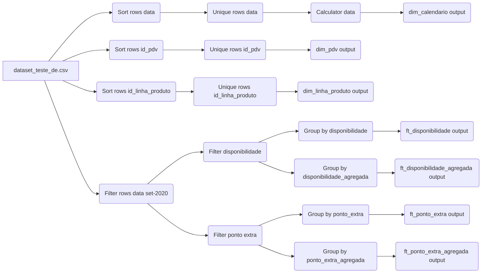

## Visão Geral

Esta transformação do Pentaho Data Integration (PDI) é responsável por ler um arquivo CSV, processar os dados e carregar em um modelo dimensional.
O fluxo é dividido em duas frentes principais: carga de tabelas de dimensão e carga de tabelas de fato.

**Fonte de Dados:**
* **Tipo:** `CSV file input`
* **Arquivo:** `dataset_teste_de.csv`
* **Descrição:** Arquivo de entrada principal contendo todos os dados brutos.

#### Fluxo 1: Dimensão Calendário (`dim_calendario`)

#### Fluxo 2: Dimensão Ponto de Venda (`dim_pdv`)

#### Fluxo 3: Dimensão Linha de Produto (`dim_linha_produto`)

#### Fluxo 4: Fato Disponibilidade (`ft_disponibilidade`)

#### Fluxo 5: Fato Disponibilidade Agregada (`ft_disponibilidade_agregada`)

#### Fluxo 6: Fato Ponto Extra (`ft_ponto_extra`)

#### Fluxo 7: Fato Ponto Extra Agregada (`ft_ponto_extra_agregada`)

